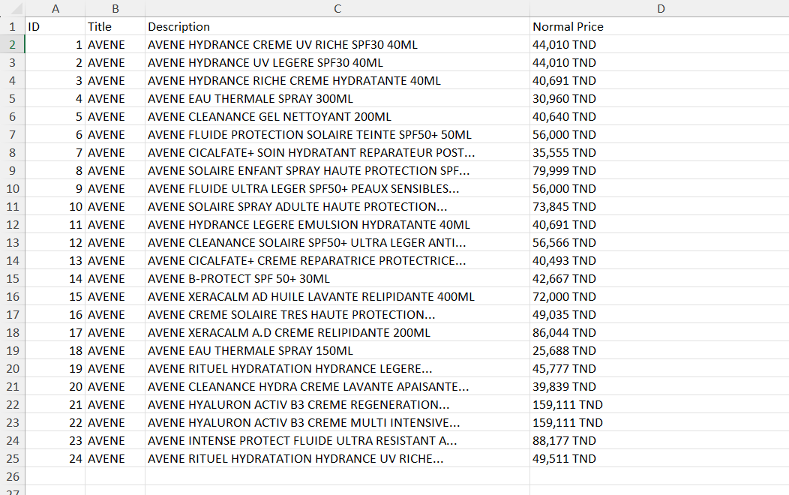
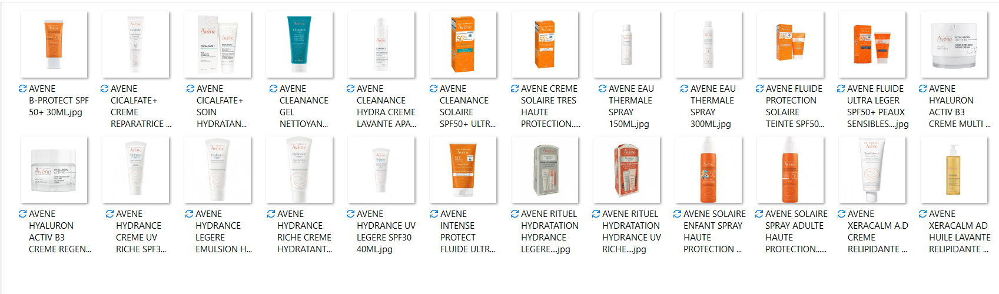

# Web Scraper for Product Data  

This project is a simple web scraper built with Python using the `BeautifulSoup` library. It extracts product information from a website and saves the data into an Excel (`.xlsx`) file.  

## Features  
- Scrapes product names, prices, and other details  
- Saves data into a structured Excel file

### Example Output  
#### Extracted Product Data 
  

#### Product Images  
  
